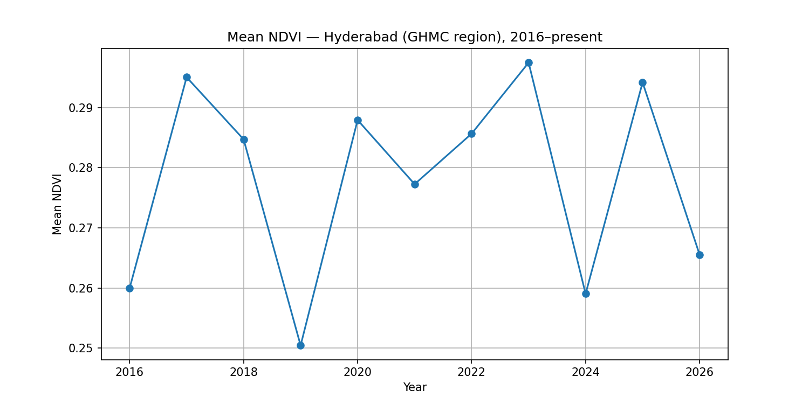
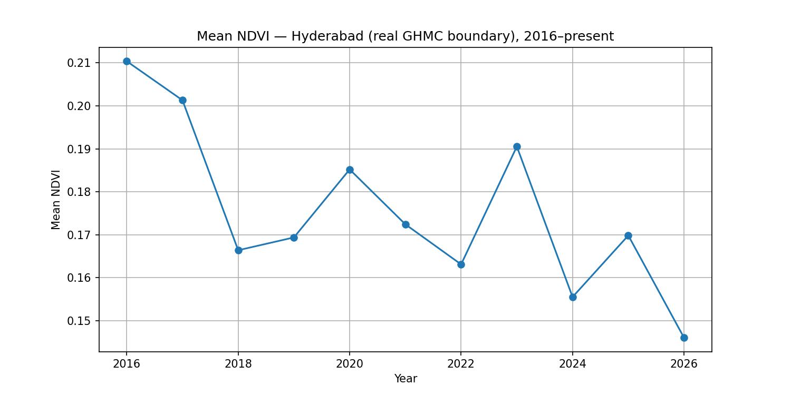
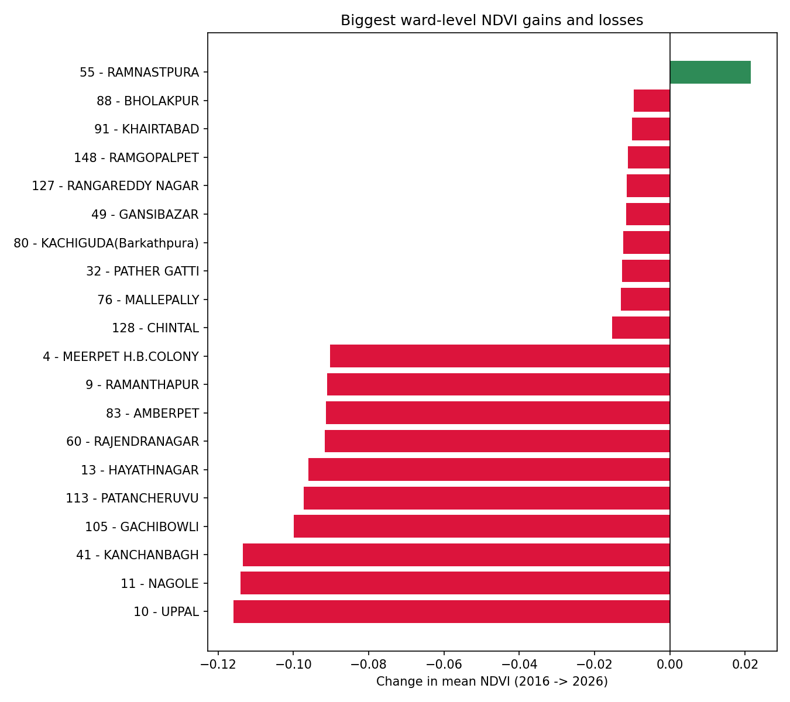
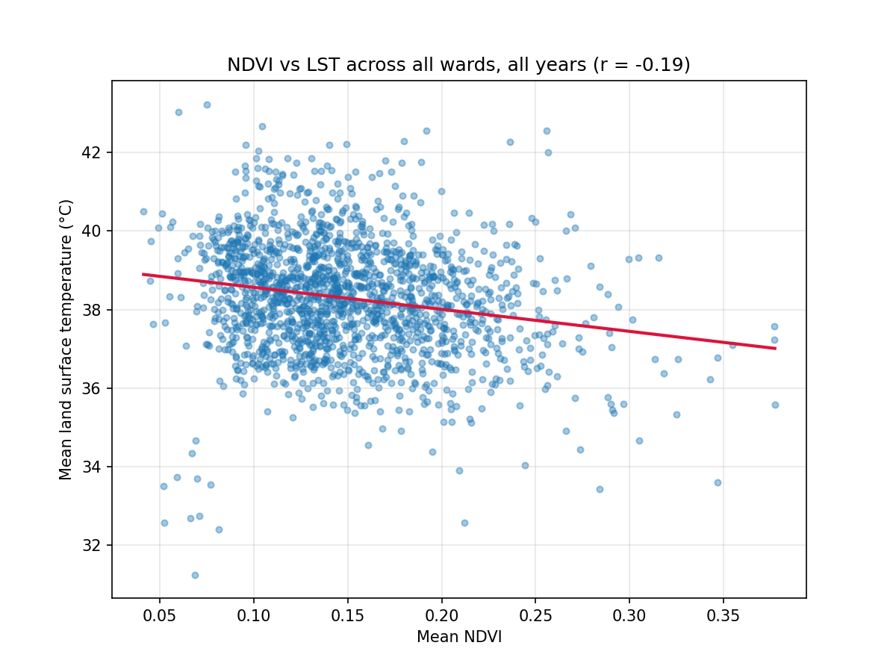
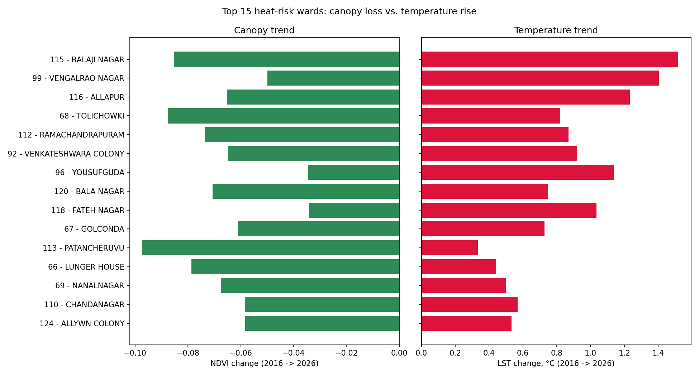
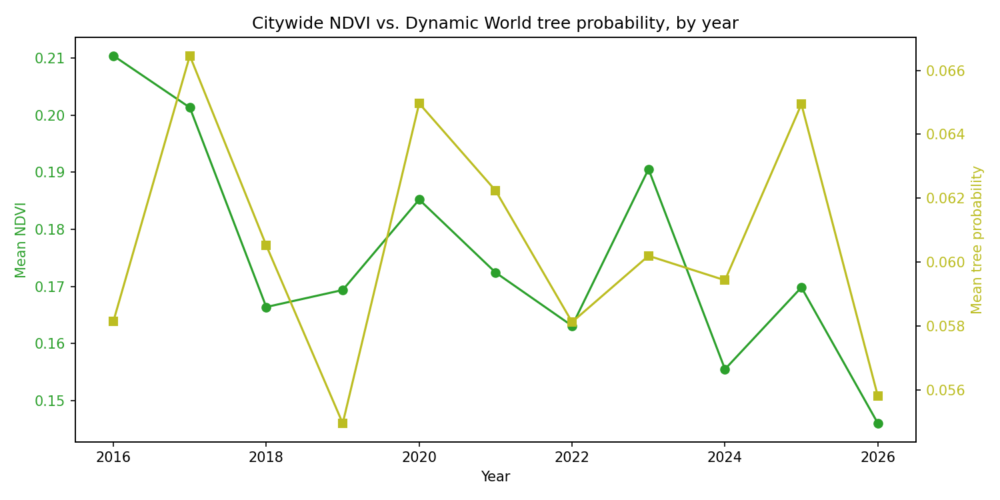

# Canopy Watch — Hyderabad

Tracking tree canopy / green cover change across Hyderabad using satellite NDVI and land surface
temperature data, ward by ward — checked against Telangana's Haritha Haram afforestation claims.

## Why this project

Telangana's Haritha Haram program (launched 2015) reports large gains in green cover, but sapling
survival rates were never systematically tracked. This project independently measures actual
canopy change using satellite data — vegetation index (NDVI) trends over time, correlated with
land surface temperature (LST) to quantify local climate impact — and checks it, where possible,
against publicly reported plantation data and an independent satellite-based tree-cover model.

## Boundary data

Ward boundaries: [OpenCity India — Hyderabad Wards Info](https://data.opencity.in/dataset/hyderabad-wards-info),
sourced from GHMC's own GIS. The live dataset currently has 155 ward features. GHMC was also
mid-way through a High Court-mandated delimitation that was expected to take it to 300 wards —
this project uses the 155-ward set that was current and legally-in-force at the start of the
project.

The citywide boundary used for analysis is the dissolved union of these 155 wards, rather than
GHMC's separately-published boundary layer, which has a geometry Earth Engine won't ingest.

**Update, July 2026:** the anticipated delimitation resolved differently than a straightforward
150→300-ward expansion. On February 11, 2026, GHMC was trifurcated into three separate municipal
corporations — the restructured GHMC (150 wards), Cyberabad Municipal Corporation (76 wards), and
Malkajgiri Municipal Corporation (74 wards), totalling 300. All analysis in this project,
including Phase 4, still uses the pre-trifurcation 155-ward boundary described above — "GHMC"
throughout this README and codebase refers to that historical extent, not the smaller
post-trifurcation entity. Revisiting the study area to cover all three successor bodies is a
candidate for a future phase.

## Results so far

**Phase 1 (MVP) — mean NDVI, 2016–present, placeholder bounding-box AOI:**



Raw values: [`outputs/hyderabad_ndvi_yearly.csv`](outputs/hyderabad_ndvi_yearly.csv)

> Note: this run uses a rough bounding box around Hyderabad/GHMC, not the actual city boundary —
> treat it as a pipeline sanity check rather than a final result. Phase 2 (real GHMC boundary +
> ward-level breakdown) refines this below.

**Phase 2 — real GHMC boundary, ward-level NDVI, 2016–present:**



Citywide (real boundary): [`outputs/hyderabad_ndvi_yearly_realboundary.csv`](outputs/hyderabad_ndvi_yearly_realboundary.csv)
Per-ward, year × ward long format: [`outputs/hyderabad_ndvi_by_ward.csv`](outputs/hyderabad_ndvi_by_ward.csv)



> The Phase 1 placeholder bounding box included a meaningful amount of non-GHMC area — the
> real-boundary citywide trend above is the first result that reflects the actual city extent.

**Phase 3 — land surface temperature (LST) + NDVI/heat correlation, 2016–present:**

Ward-level LST: [`outputs/hyderabad_lst_by_ward.csv`](outputs/hyderabad_lst_by_ward.csv)
Merged NDVI + LST table: [`outputs/hyderabad_ndvi_lst_by_ward.csv`](outputs/hyderabad_ndvi_lst_by_ward.csv)



The scatter plot's title reports the Pearson correlation between ward-level NDVI and LST across
every ward-year in the dataset — the core urban-heat-island signal this project set out to
measure. A negative slope means greener wards run measurably cooler.

Heat-risk shortlist — wards where canopy declined *and* temperature rose the most, first year vs.
most recent: [`outputs/hyderabad_heat_risk_wards.csv`](outputs/hyderabad_heat_risk_wards.csv)



> LST is computed from Landsat 8/9 thermal data at 30 m resolution, vs. NDVI's 10 m (Sentinel-2) —
> ward-level averages are still directly comparable, but the two aren't pixel-for-pixel aligned.

**Phase 4 — tree-cover accountability check, 2016–2025:**

The original plan was to compare satellite-measured canopy trends against official Haritha Haram
sapling-planting data. The Telangana Forest Department's public tracking portal (FMIS) returned no
usable figures as of July 2026 — every field empty. Rather than build an analysis on unreliable
self-reported numbers, this phase instead cross-references two independent satellite-derived
signals: the NDVI/LST-based heat-risk shortlist from Phase 3, and a tree-specific canopy signal
from Google's Dynamic World deep-learning land-cover model (`GOOGLE/DYNAMICWORLD/V1`, 10 m
resolution, `trees`-class probability), computed per ward per year.

Ward-level tree probability: [`outputs/hyderabad_treecover_dynamicworld_by_ward.csv`](outputs/hyderabad_treecover_dynamicworld_by_ward.csv)
Ward-level change, 2016 → 2025: [`outputs/hyderabad_treecover_change_by_ward.csv`](outputs/hyderabad_treecover_change_by_ward.csv)



Tree-probability change correlates positively and significantly with Phase 3's NDVI change
(r=0.23, p=0.004, n=150) — the two independently-derived vegetation signals broadly agree in
direction citywide, cross-validating both.

Cross-referenced against the Phase 3 heat-risk shortlist: [`outputs/hyderabad_heat_risk_treecover_cross_check.csv`](outputs/hyderabad_heat_risk_treecover_cross_check.csv)

Phase 3's heat-risk score does **not** significantly predict this tree-specific change (r=0.09,
p=0.27, n=150). The 15 wards flagged as highest heat-risk in Phase 3 average a slightly *positive*
tree-probability change (+0.0085) — above the citywide average — with only 4 of the 15 showing an
actual decline. The clearest case of agreement is Ward 113 (Patancheruvu, Serilingampally Zone),
the 11th-highest heat-risk ward, which also shows one of the steepest measured declines (-0.013).
The single steepest tree-cover decline citywide — Ward 4, Meerpet H.B. Colony, L.B. Nagar Zone,
-0.036 — is a ward Phase 3 never flagged as elevated risk at all.

> This does not confirm that Phase 3's NDVI/LST-identified heat-risk wards are also the wards
> with the worst tree-specific canopy loss. Possible reasons, none confirmed here: NDVI decline
> can reflect non-tree vegetation loss that a tree-specific classifier wouldn't register the same
> way; the two metrics' comparison windows may not be perfectly aligned; the measured
> tree-probability changes are small in absolute terms and may partly reflect classifier noise
> rather than real canopy change. This is a genuine open question the project surfaces rather than
> resolves.

> The FMIS attempt itself is documented in [`notebooks/04_haritha_haram_overlay.ipynb`](notebooks/04_haritha_haram_overlay.ipynb)
> and [`outputs/haritha_haram_overlay.png`](outputs/haritha_haram_overlay.png) (NDVI/LST only,
> since no plantation figures were available). A provisional, press-sourced timeline of official
> planting claims is in [`data/haritha_haram_claims_timeline.csv`](data/haritha_haram_claims_timeline.csv)
> — narrative context only, not analysis-grade (it mixes targets, achieved counts, nursery stock,
> and single-day counts, so it isn't used in any calculation above).

> **Known data-quality note:** this cross-check covers 150 wards, not the full 155 in the live
> boundary dataset — Phase 3's heat-risk table appears to be missing 5 wards, cause not yet
> identified. Worth resolving before Phase 5.

## Stack

- **Google Earth Engine (Python API)** — all satellite computation runs server-side on Google's
  infrastructure. You never download raw scene imagery; you query aggregated results (a mean
  NDVI/LST value for a region-year, a small exported PNG/GeoTIFF). This is why the project is
  Colab-friendly with minimal storage use.
- **Google Colab** — free compute, no local setup. Mount Google Drive for persistent storage of
  outputs between sessions (Colab's local disk is wiped when the runtime disconnects).
- **geemap** — adds interactive map display and easier GEE→pandas/matplotlib workflows on top of
  the raw `earthengine-api`.
- **geopandas + shapely** (from Phase 2) — loading, cleaning, and repairing the real ward/boundary
  geometries before they go into Earth Engine.
- **scipy** (from Phase 3) — Pearson correlation between ward-level NDVI and LST, and (from Phase
  4) between tree-cover change and both NDVI change and heat-risk score.
- **Dynamic World** (`GOOGLE/DYNAMICWORLD/V1`, from Phase 4) — a pre-trained deep-learning
  land-cover model available directly in Earth Engine; no new Python packages needed, just a
  different `ImageCollection`.
- **Streamlit + Folium/leafmap** (later phase) — dashboard layer.

## Storage strategy

- Raw Sentinel-2/Landsat imagery: **never downloaded**. GEE queries return aggregated stats only.
- Outputs saved to Drive (`/content/drive/MyDrive/canopy-watch-hyderabad/outputs/`): CSVs (time
  series), PNGs (charts/thumbnails), occasional small clipped GeoTIFFs for dashboard visuals (tens
  of MB, not GB).
- Ward/boundary source files saved to Drive
  (`/content/drive/MyDrive/canopy-watch-hyderabad/data/`): small KML and CSV files (a few MB at
  most).
- Only code, small CSVs, KMLs, and PNGs get pushed to GitHub. Anything in `outputs/*.tif` is
  gitignored — keep those in Drive only.

## Setup

1. Register for Earth Engine access: https://signup.earthengine.google.com (non-commercial/research use).
   - If your Google account is a managed school account with restricted Cloud project creation or
     third-party OAuth, register with a personal Gmail instead. You can still mount your school
     Drive in the same Colab notebook — they're independent auth flows.
2. Open `notebooks/01_setup_ndvi_pipeline.ipynb` in Google Colab (upload it, or open directly from
   GitHub via Colab's "Open notebook → GitHub" tab once this repo is pushed).
3. Run the notebook top to bottom. It will prompt you to authenticate with Earth Engine
   (`ee.Authenticate()`) and mount Drive.
4. Replace the placeholder `PROJECT_ID` in the `ee.Initialize()` call with the Cloud project ID you
   get during Earth Engine registration (this project uses `canopy-watch-hyderabad`).
5. Then run `notebooks/02_ward_level_ndvi.ipynb` — it downloads the real GHMC ward boundaries
   automatically, replacing the Phase 1 placeholder bounding box, and produces the ward-level NDVI
   breakdown.
6. Then run `notebooks/03_lst_correlation.ipynb` — it reloads the same ward boundaries, computes
   yearly land surface temperature per ward from Landsat 8/9, merges it with the Phase 2 NDVI
   table, and produces the NDVI/LST correlation and heat-risk outputs above.
7. Then run `notebooks/04_haritha_haram_overlay.ipynb` — attempts to load official Haritha Haram
   sapling-planting data (see `data/haritha_haram_ghmc_annual.csv`) and compare it against the
   citywide NDVI/LST trends. As of July 2026 the official FMIS portal has no usable data, so this
   notebook currently runs with the NDVI/LST comparison only — see the note inside the notebook
   for how to source the plantation data manually if the portal is fixed or you're revisiting this
   later.
8. Then run `notebooks/05_tree_cover_dynamicworld.ipynb` — reloads the same ward boundaries,
   computes yearly tree-cover probability per ward using Google's Dynamic World model, and
   cross-references the result against the Phase 3 heat-risk shortlist.

## Roadmap

- **✅ Phase 1 — Setup + NDVI MVP** (`01_setup_ndvi_pipeline.ipynb`): auth, rough AOI, yearly mean
  NDVI trend for Hyderabad, 2016–present.
- **✅ Phase 2 — Real boundary + ward-level breakdown** (`02_ward_level_ndvi.ipynb`): sourced the
  actual GHMC ward boundaries (155 wards, GHMC's own GIS via OpenCity India), re-ran NDVI against
  the real city extent, and computed yearly mean NDVI per ward.
- **✅ Phase 3 — Climate correlation** (`03_lst_correlation.ipynb`): computed yearly land surface
  temperature per ward from Landsat 8/9 thermal data, correlated it against ward-level NDVI, and
  produced a heat-risk shortlist of wards with the worst combined canopy-loss/temperature-rise trend.
- **✅ Phase 4 — Tree-cover accountability check** (`04_haritha_haram_overlay.ipynb`,
  `05_tree_cover_dynamicworld.ipynb`): attempted to source official Haritha Haram sapling data via
  FMIS (portal returned no usable figures as of July 2026); pivoted to a satellite-only
  cross-check using Google's Dynamic World tree-cover model against the Phase 3 heat-risk
  shortlist. Result: the two vegetation signals (NDVI, tree-probability) agree citywide, but
  heat-risk-flagged wards don't show a statistically significant tree-specific decline over the
  same period — an open question, not a confirmed accountability story.
- **Phase 4b (stretch, not done)** — ward-level Haritha Haram data via FMIS's geo-tagged site
  export or an RTI request.
- **Phase 4c (stretch, not done)** — Hansen Global Forest Change `lossyear` layer
  (`UMD/hansen/global_forest_change_2025_v1_13`) for discrete, year-stamped canopy-loss events per
  ward.
- **Phase 5 — Dashboard**: Streamlit + Folium/leafmap app — select an area, see its NDVI trend,
  LST trend, and tree-cover trend (plus Haritha Haram context where available).

## Repo structure

```
canopy-watch-hyderabad/
├── README.md
├── requirements.txt
├── .gitignore
├── data/
│   ├── ghmc_wards.kml
│   ├── ghmc_boundary.kml
│   ├── haritha_haram_claims_timeline.csv
│   └── haritha_haram_ghmc_annual.csv
├── notebooks/
│   ├── 01_setup_ndvi_pipeline.ipynb
│   ├── 02_ward_level_ndvi.ipynb
│   ├── 03_lst_correlation.ipynb
│   ├── 04_haritha_haram_overlay.ipynb
│   └── 05_tree_cover_dynamicworld.ipynb
└── outputs/
    ├── hyderabad_ndvi_yearly.csv
    ├── ndvi_trend.png
    ├── hyderabad_ndvi_yearly_realboundary.csv
    ├── ndvi_trend_realboundary.png
    ├── hyderabad_ndvi_by_ward.csv
    ├── ward_ndvi_change.png
    ├── hyderabad_lst_by_ward.csv
    ├── hyderabad_ndvi_lst_by_ward.csv
    ├── ndvi_lst_scatter.png
    ├── hyderabad_heat_risk_wards.csv
    ├── ward_heat_risk.png
    ├── haritha_haram_overlay.png
    ├── hyderabad_treecover_dynamicworld_by_ward.csv
    ├── hyderabad_treecover_change_by_ward.csv
    ├── hyderabad_heat_risk_treecover_cross_check.csv
    └── ndvi_vs_treecover_sanity_check.png
```
