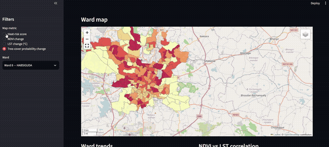
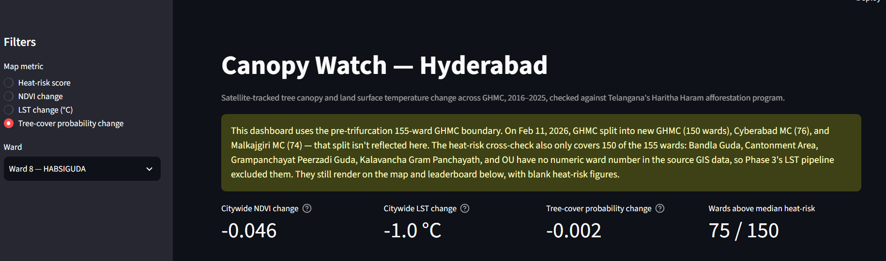
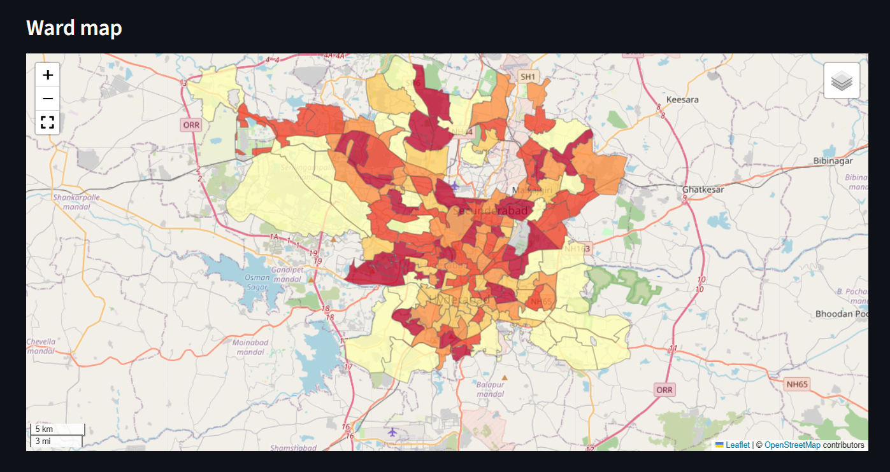
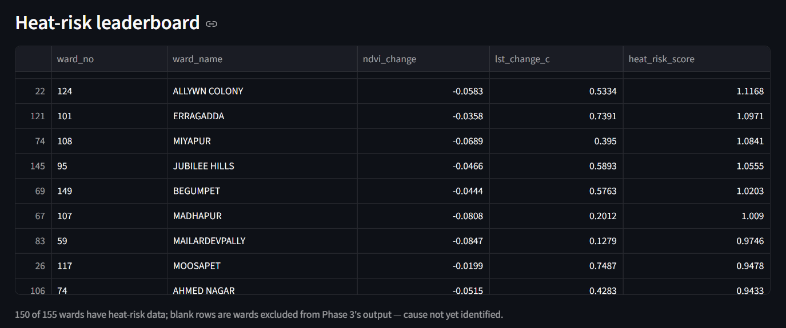

# Canopy Watch — Hyderabad

Tracking tree canopy and land surface temperature change across Hyderabad from satellite data, checked against Telangana's official Haritha Haram afforestation program.

[](https://canopy-watch-hyderabad.streamlit.app/)
[](https://www.python.org/)
[](https://earthengine.google.com/)

**[→ Open the live dashboard](https://canopy-watch-hyderabad.streamlit.app/)**



---

## Contents

- [Overview](#overview)
- [Headline finding](#headline-finding)
- [Glossary — what these terms mean](#glossary--what-these-terms-mean)
- [Screenshots](#screenshots)
- [How it works](#how-it-works)
- [Repo structure](#repo-structure)
- [Roadmap](#roadmap)
- [Known limitations](#known-limitations)
- [Running it yourself](#running-it-yourself)
- [Data sources](#data-sources)

---

## Overview

Hyderabad has had two visible, competing forces acting on its tree cover over the last decade: rapid urban development, and Telangana's state-run Haritha Haram afforestation drive. This project measures both sides from satellite data instead of taking either narrative at face value:

- **NDVI trend** (Sentinel-2, 2016–2025) per ward, GHMC's 155-ward boundary
- **Land surface temperature** (Landsat 8/9) per ward, correlated against NDVI
- **Tree-cover probability** (Google's Dynamic World model) as an independent cross-check
- A **heat-risk score** combining canopy decline with temperature rise, to flag which wards are worst off
- A check against **Haritha Haram**'s own reporting — with an honest account of where that data wasn't available

It's a portfolio project (Earth Engine, geospatial analysis, Streamlit) built with a genuine civic angle: an independently-verifiable account of where Hyderabad's tree cover is actually going, ward by ward.

## Headline finding

Tree-cover probability change correlates significantly with NDVI change (**r=0.23, p=0.004, n=150**) — the two independent satellite measures agree with each other, which is a good sanity check. But tree-cover change does **not** correlate with the heat-risk score (**r=0.09, p=0.27**). That's reported as an open, unresolved finding rather than stretched into a conclusion either direction — see the [glossary](#glossary--what-these-terms-mean) for what r and p mean if you're not familiar.

## Glossary — what these terms mean

<details>
<summary>Click to expand — plain-language definitions</summary>

| Term | What it means |
|---|---|
| **NDVI** | Normalized Difference Vegetation Index — a 0 to 1 score from satellite imagery showing how much healthy green vegetation is in an area. Higher = more/healthier plant cover; lower = bare ground, concrete, or water. |
| **LST (land surface temperature)** | How hot the ground itself is, from satellite thermal sensors — not air temperature from a weather forecast. Less tree cover and more concrete tends to mean a hotter surface (the "urban heat island" effect). |
| **Tree-cover probability** | A separate satellite estimate (Google's Dynamic World model) of how likely a patch of ground is to be covered by trees specifically, versus NDVI's broader "any vegetation" measure. |
| **Heat-risk score** | A combined per-ward score: how much hotter it's gotten (LST change) minus how much greener it's gotten (NDVI change). Higher scores flag wards heating up without gaining canopy to offset it. |
| **Correlation (r)** | A number from -1 to 1 showing how strongly two things move together. Close to 1 = rise and fall in step; close to 0 = little to no relationship. |
| **p-value** | How likely an observed pattern is just random chance. Under 0.05 is the usual line for "probably a real pattern, not noise." |
| **Ward** | GHMC's smallest administrative division — like a city council district. Hyderabad had 155 as of this project's data. |
| **GHMC** | Greater Hyderabad Municipal Corporation — the city government body responsible for the metro area covered here. |
| **Haritha Haram** | Telangana state's official tree-planting program, checked here against satellite-observed canopy change. |

</details>

## Screenshots

<details open>
<summary>Dashboard overview</summary>


</details>

<details>
<summary>Ward choropleth map</summary>


</details>

<details>
<summary>Heat-risk leaderboard and Haritha Haram cross-check</summary>


</details>

## How it works

All satellite computation runs server-side in **Google Earth Engine** (no raw imagery downloads) via Colab notebooks. Outputs land as CSVs in `outputs/`, which a **Streamlit** dashboard reads and renders — the dashboard itself does no satellite processing.

```
Earth Engine (Sentinel-2, Landsat 8/9, Dynamic World)
        │  reduceRegions per ward
        ▼
   Colab notebooks  ──────────▶  outputs/*.csv
        │                             │
        ▼                             ▼
  data/ghmc_wards.kml  ──────▶  Streamlit dashboard (app.py)
   (ward geometry)                    │
                                       ▼
                          leafmap/folium choropleth,
                          Plotly trend + correlation charts
```

## Repo structure

```
canopy-watch-hyderabad/
├── app.py                                  # Streamlit entry point
├── dashboard/
│   ├── data_loader.py                      # cached CSV/KML loading + column resolution
│   ├── components.py                       # scope banner, glossary, KPI cards, ward selector
│   ├── map_view.py                         # leafmap/folium choropleth + legend
│   └── charts.py                           # Plotly trend + correlation charts
├── data/
│   ├── ghmc_wards.kml                      # 155-ward boundary geometry
│   ├── ghmc_boundary.kml
│   └── haritha_haram_*.csv
├── notebooks/
│   ├── 01_setup_ndvi_pipeline.ipynb
│   ├── 02_ward_level_ndvi.ipynb
│   ├── 03_lst_correlation.ipynb
│   ├── 04_haritha_haram_overlay.ipynb
│   └── 05_tree_cover_dynamicworld.ipynb
├── outputs/                                # CSVs + PNGs the dashboard reads
├── docs/
│   ├── demo.gif
│   └── screenshots/
├── requirements.txt
└── README.md
```

## Roadmap

- [x] **Phase 1** — Yearly mean-NDVI pipeline (Sentinel-2, 2016–present)
- [x] **Phase 2** — Real GHMC ward boundaries (155 wards), ward-level NDVI
- [x] **Phase 3** — Landsat LST per ward, NDVI/LST correlation, heat-risk scoring
- [x] **Phase 4** — Haritha Haram cross-check (pivoted to Dynamic World satellite-only comparison after FMIS returned no usable data)
- [x] **Phase 5** — Streamlit + leafmap dashboard, deployed publicly

**Optional / not done:**

- [ ] **Phase 4b** *(stretch)* — Ward-level Haritha Haram planting data via FMIS's geo-tagged site export, or an RTI request, if the state ever publishes usable figures
- [ ] **Phase 4c** *(stretch)* — Hansen Global Forest Change `lossyear` layer, for discrete year-stamped canopy-loss events per ward rather than annual aggregates

The core roadmap (Phases 1–5) is complete. 4b and 4c were always flagged optional — worth doing if you want to push the accountability angle further, not required for the project to stand on its own.

## Known limitations

- **Pre-trifurcation boundary.** This project uses GHMC's 155-ward boundary throughout. On Feb 11, 2026, GHMC split into three separate corporations (new GHMC: 150 wards, Cyberabad MC: 76, Malkajgiri MC: 74) — that split isn't reflected anywhere in this analysis.
- **5 wards with no formal ward number.** Bandla Guda, Cantonment Area, Grampanchayat Peerzadi Guda, Kalavancha Gram Panchayath, and OU are annexed areas with no numeric ward ID in GHMC's GIS data, so Phase 3's LST/heat-risk pipeline excluded them. They still appear on the map and leaderboard with blank metric columns.
- **Haritha Haram data gap.** The Telangana Forest Department's FMIS portal had no usable ward-level sapling data as of July 2026, so Phase 4's cross-check is satellite-only (Dynamic World vs. heat-risk), not a direct check against official planting figures.

## Running it yourself

**Notebooks** (Colab, no local setup): open `notebooks/01–05` in order, each depends on the last. Outputs are already computed and committed to `outputs/`, so you only need to rerun these if you want fresher satellite data.

**Dashboard** (local):

```bash
git clone https://github.com/YOUR_USERNAME/canopy-watch-hyderabad.git
cd canopy-watch-hyderabad
python3 -m venv venv && source venv/bin/activate   # Windows: venv\Scripts\activate
pip install -r requirements.txt
streamlit run app.py
```

## Data sources

- Sentinel-2 (NDVI), Landsat 8/9 Collection 2 Level-2 (LST), Dynamic World V1 (tree-cover probability) — via Google Earth Engine
- GHMC ward boundaries — [OpenCity India](https://data.opencity.in/dataset/hyderabad-wards-info), sourced from GHMC's own GIS
- Haritha Haram program data — Telangana Forest Department FMIS portal (limited availability, see [Known limitations](#known-limitations))
